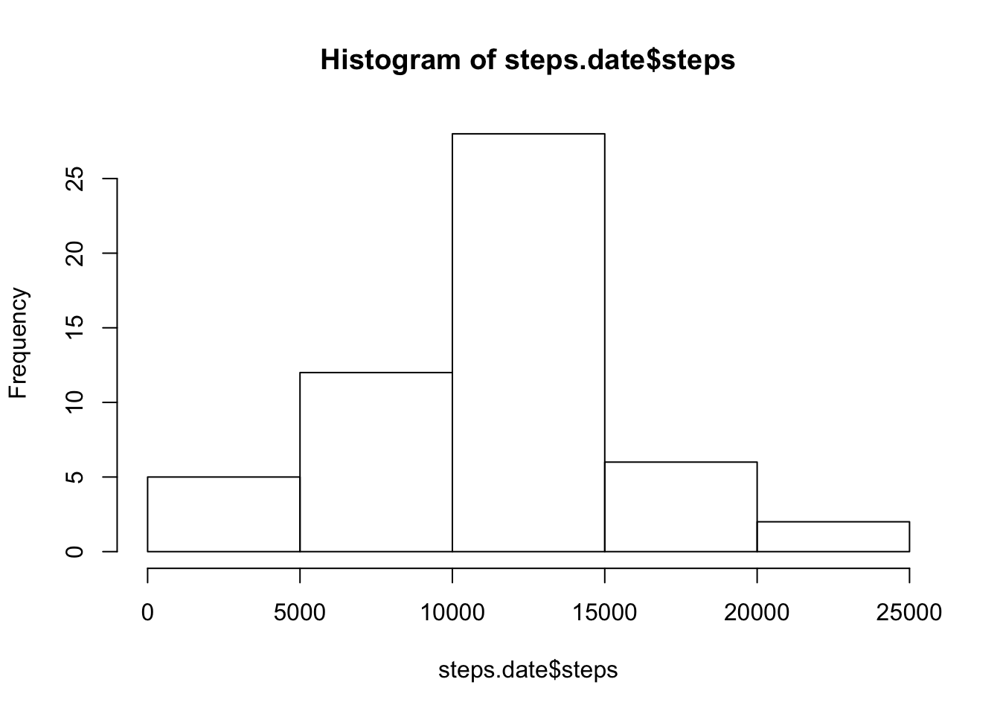
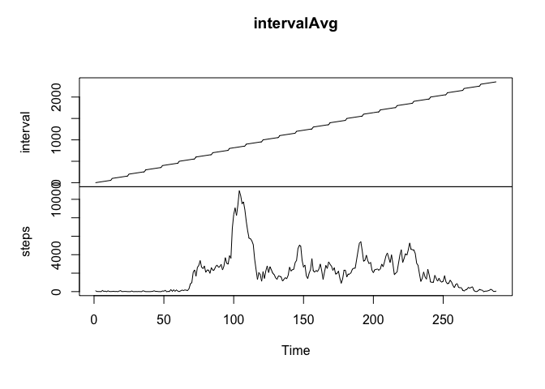
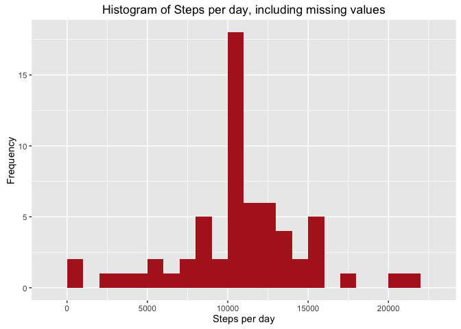
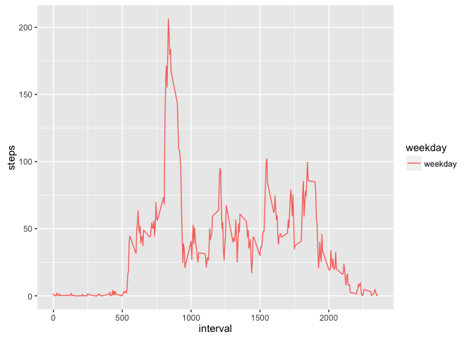

#"Reproducible Research: Peer Assessment 1"
output: 
  html_document:
    keep_md: true


## Loading and preprocessing the data

```r
setwd("/Users/hitanshupande/Documents/Reproducible Research/")
library(dplyr)
```

```
## 
## Attaching package: 'dplyr'
```

```
## The following objects are masked from 'package:stats':
## 
##     filter, lag
```

```
## The following objects are masked from 'package:base':
## 
##     intersect, setdiff, setequal, union
```

```r
library(ggplot2)
```

```
## Warning: package 'ggplot2' was built under R version 3.2.3
```

```r
library(knitr)
```

```
## Warning: package 'knitr' was built under R version 3.2.3
```

```r
library(lubridate)
```

```
## Warning: package 'lubridate' was built under R version 3.2.3
```

```r
data <- read.csv("activity.csv")
```


## Add a new column with the type of day, weekday or weekend 

```r
data$weekday <- as.POSIXct(data$date)
data$weekday <- weekdays(data$weekday)
```

## Remove NA values

```r
cleandata <- data[!is.na(data$steps),]
```

## calculate sum of all steps by date

```r
steps.date <- aggregate(steps ~ date, cleandata, sum)
head(steps.date)
```

```
##         date steps
## 1 2012-10-02   126
## 2 2012-10-03 11352
## 3 2012-10-04 12116
## 4 2012-10-05 13294
## 5 2012-10-06 15420
## 6 2012-10-07 11015
```

##Plot a histogram of total steps taken

```r
hist(steps.date$steps)
```

<!-- -->


## What is mean total number of steps taken per day?

##Mean of steps taken per day

```r
mean(steps.date$steps)
```

```
## [1] 10766.19
```

##Median of steps taken per day

```r
median(steps.date$steps)
```

```
## [1] 10765
```

## What is the average daily activity pattern?

##Calculate sum of steps per interval

```r
intervalAvg <- aggregate(steps ~ interval, cleandata, sum)
```

##Plot time series graph of steps per interval

```r
plot.ts(intervalAvg)
```

<!-- -->

## Interval with maximum number of steps (835)

```r
intervalAvg[intervalAvg$steps==max(intervalAvg$steps),]
```

```
##     interval steps
## 104      835 10927
```

##Total number of NA values in dataset

```r
nrow(data[is.na(data$steps),])
```

```
## [1] 2304
```

##Strategy to fill NA values is to replace them with average steps for given time interval
##Create a dataframe with only NA values

```r
data_full <- data
nas <- is.na(data_full$steps)
avg_interval <- tapply(data_full$steps, data_full$interval, mean, na.rm=TRUE, simplify=TRUE)
data_full$steps[nas] <- avg_interval[as.character(data_full$interval[nas])]

steps_full <- data_full %>%filter(!is.na(steps)) %>%group_by(date) %>%summarize(steps = sum(steps))
## Plot histogram 
    ggplot(steps_full, aes(x = steps)) +
    geom_histogram(fill = "firebrick", binwidth = 1000) +
    labs(title = "Histogram of Steps per day, including missing values", x = "Steps per day", y = "Frequency")
```

<!-- -->

```r
mean_steps_full <- mean(steps_full$steps, na.rm = TRUE)
median_steps_full <- median(steps_full$steps, na.rm = TRUE)

mean_steps_full
```

```
## [1] 10766.19
```

```r
median_steps_full
```

```
## [1] 10766.19
```
## Are there differences in activity patterns between weekdays and weekends?


```r
data_full <- mutate(data_full, weekday = ifelse(data_full$date == "Saturday" | data_full$date == "Sunday", "weekend", "weekday"))
data_full$weekday <- as.factor(data_full$weekday)

interval_full <- data_full %>%
    group_by(interval, weekday) %>%
    summarise(steps = mean(steps))
s <- ggplot(interval_full, aes(x=interval, y=steps, color = weekday)) +
    geom_line()
print(s)
```

<!-- -->

```r
knit2html("PA1_template.html")
```

```
## 
## 
## processing file: PA1_template.html
```

```
## 
  |                                                                       
  |                                                                 |   0%
  |                                                                       
  |.................................................................| 100%
##   ordinary text without R code
```

```
## output file: PA1_template.txt
```
